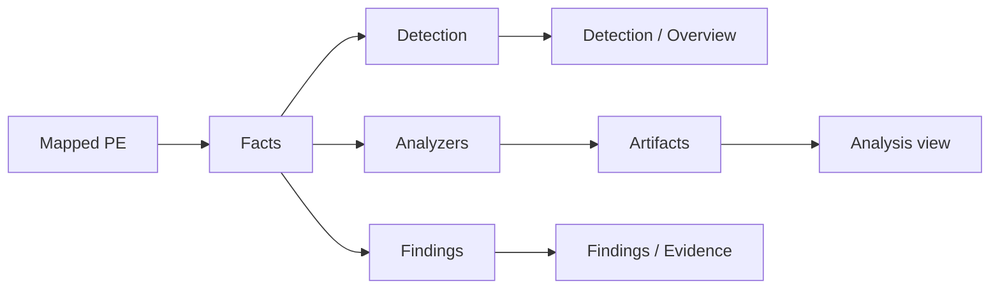

# Analysis

[English](analysis.md) | [Türkçe](../tr/analysis.md)

## Facts

After parse, the host fills a fact model: sections, imports, overlay, CLR, strings, entropy, Rich header, and similar PE/.NET fields. Detection rules and findings read this model. They do not execute the binary.

## Detection

Rules are JSON under `signatures/builtin/` (shipped), `signatures/packs/`, then `signatures/user/`. Schema **1** is documented in [`signatures/README.md`](../../signatures/README.md) — that file is the author reference; this page does not repeat the leaf table.

Default matcher is **KUARA-Dynamic** (`third_party/kuara_dynamic`, adapter `src/detect/kuara_adapter.cpp`). If KUARA fails to compile the rule set, the host logs a warning and uses the internal matcher. Settings can force the engine.

`product_key` groups several rules into one Overview/Detection row. `heuristic: true` is generic evidence, not a product name.

Reload: Settings → Detection → reload signatures (see UI copy there).

## Specialized analyzers

Static C++ providers in `src/analyze/` (not plugins):

- **py2exe** — reconstruct marshal from `PYTHONSCRIPT`
- **Go** — buildinfo and pclntab (function tables for 1.16+; older tables detected only)
- **AutoIt** — SCRIPT / overlay inventory
- **AutoHotkey** — Ahk2Exe overlay/RCDATA inventory and plaintext fragments
- **LabVIEW** — NI RSRC container and block inventory (diagram usually stripped in Application Builder EXEs)

The **Analysis** view renders generic artifact trees. Identity of a packer still belongs in JSON signatures, not in these providers.

## Findings

`src/findings/` scores structural and string patterns (suspicious imports, persistence strings, broken alignment, …). Evidence pane shows why a finding fired. This list is not the same as Detection products.

## Hex vs RVA

Detection patterns can target entry bytes, whole file, or overlay. Hex selection is always a **file offset**. Plugins convert with `rva_to_off` / `off_to_rva` when they talk to Hex.
