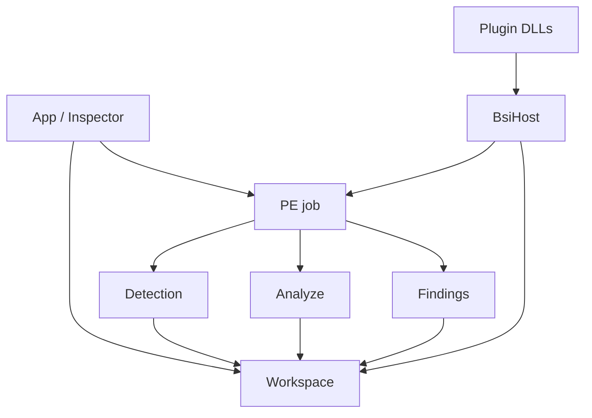

# Architecture

[English](architecture.md) | [Türkçe](../tr/architecture.md)

```
src/app        welcome, inspector shell, settings, version
src/engine     Win32 window, D3D11 device, drop files
src/pe         map, parse, patch, save/backup
src/detect     facts, JSON signatures, KUARA adapter
src/analyze    specialized artifact providers
src/findings   host findings
src/ui         docking workspace, hex, theme, widgets
src/plugin     LoadLibrary scan, BsiHost fill
src/persist    settings.json, paths beside the exe
src/i18n       languages/*.json
sdk/plugin     public ABI header + README
plugins/       submodules (Lydis, DecompSnake)
```



**Engine** owns the OS window and GPU. **App** switches Welcome / Inspector / Settings. **PE** holds the mapped buffer; everything else reads it. **Detection** and **Findings** are separate lists. **Plugins** see the same job through `BsiHost` (image bytes, hex cursor, toast, progress). They do not call into `src/` by include.

UI strings: add keys to both `languages/en.json` and `languages/tr.json` when the UI changes.

This page is a map, not a file-by-file commentary.
