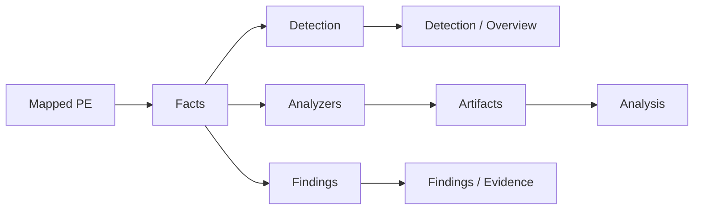

# Analiz

[English](../en/analysis.md) | [Türkçe](analysis.md)

## Facts

Parse'tan sonra host fact model'i doldurur: section, import, overlay, CLR, string, entropy, Rich Header ve benzeri PE/.NET alanları. Detection ve Findings bu modeli okur. Binary execute edilmez.

## Detection

Rule'lar `signatures/builtin/` (shipped), `signatures/packs/`, sonra `signatures/user/`. Schema **1** [`signatures/README.md`](../../signatures/README.md) dosyasındadır — yazar referansı orasıdır; bu sayfa leaf tablosunu tekrar etmez.

Default matcher **KUARA-Dynamic** (`third_party/kuara_dynamic`, `src/detect/kuara_adapter.cpp`). KUARA rule set'i compile edemezse warning yazar ve internal matcher'a düşer. Settings'ten engine zorlanabilir.

`product_key` birkaç rule'u tek Overview/Detection satırında toplar. `heuristic: true` generic evidence'dır, ürün adı değildir.

Reload: Settings → Detection.

## Specialized analyzer'lar

`src/analyze/` altında static C++ (plugin değil):

- **py2exe** — `PYTHONSCRIPT` marshal
- **Go** — buildinfo ve pclntab (1.16+ function table; eskiler yalnızca detect)
- **AutoIt** — SCRIPT / overlay inventory
- **AutoHotkey** — Ahk2Exe overlay/RCDATA ve plaintext fragment

**Analysis** view generic artifact tree çizer. Packer kimliği JSON signature'da kalır.

## Findings

`src/findings/` structural ve string pattern'lerini skorlar. Evidence panel nedeni gösterir. Detection product listesi değildir.

## Hex ve RVA

Detection pattern'leri entry-point byte'ları, tüm file veya overlay hedefleyebilir. Hex selection her zaman **file offset**. Plugin'ler Hex ile konuşurken `rva_to_off` / `off_to_rva` kullanır.
