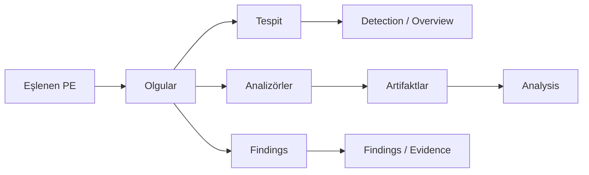

# Analiz

[English](../en/analysis.md) | [Türkçe](analysis.md)

## Olgular

Ayrıştırmadan sonra host olgu modeli doldurur: bölümler, import, overlay, CLR, string, entropi, Rich başlığı ve benzeri PE/.NET alanları. Tespit ve findings bu modeli okur. İkili çalıştırılmaz.

## Tespit

Kurallar `signatures/builtin/` (dağıtılan), `signatures/packs/`, sonra `signatures/user/`. Şema **1** [`signatures/README.md`](../../signatures/README.md) dosyasındadır — yazar referansı orasıdır; bu sayfa yaprak tablosunu tekrar etmez.

Varsayılan eşleştirici **KUARA-Dynamic** (`third_party/kuara_dynamic`, `src/detect/kuara_adapter.cpp`). KUARA kural kümesini derleyemezse uyarı yazar ve dahili eşleştiriciye düşer. Ayarlardan motor zorlanabilir.

`product_key` birkaç kuralı tek Overview/Detection satırında toplar. `heuristic: true` genel kanıttır, ürün adı değildir.

Yenileme: Settings → Detection (arayüzdeki reload).

## Özel analizörler

`src/analyze/` altında statik C++ (eklenti değil):

- **py2exe** — `PYTHONSCRIPT` marshal
- **Go** — buildinfo ve pclntab (1.16+ fonksiyon tabloları; eskiler yalnızca tespit)
- **AutoIt** — SCRIPT / overlay envanteri
- **AutoHotkey** — Ahk2Exe overlay/RCDATA ve düz metin parçaları

**Analysis** görünümü genel artifakt ağacı çizer. Packer kimliği JSON imzada kalır.

## Findings

`src/findings/` yapı ve string kalıplarını puanlar. Evidence paneli nedeni gösterir. Detection ürün listesi değildir.

## Hex ve RVA

Tespit örüntüleri giriş baytları, tüm dosya veya overlay hedefleyebilir. Hex seçimi her zaman **dosya ofseti**. Eklentiler Hex ile konuşurken `rva_to_off` / `off_to_rva` kullanır.
