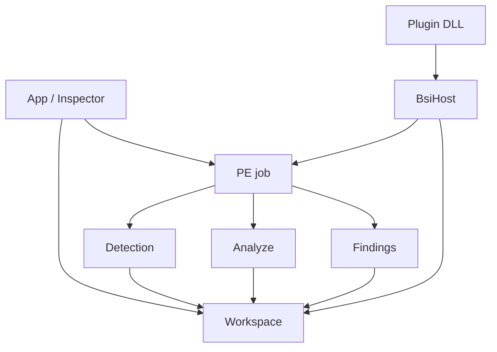

# Mimari

[English](../en/architecture.md) | [Türkçe](architecture.md)

```
src/app        welcome, inspector shell, settings, version
src/engine     Win32 window, D3D11, file drop
src/pe         map, parse, patch, save/backup
src/detect     facts, JSON signature, KUARA adapter
src/analyze    artifact provider'lar
src/findings   host findings
src/ui         dock, hex, theme, widget
src/plugin     LoadLibrary scan, BsiHost
src/persist    settings.json, exe yanı path'ler
src/i18n       languages/*.json
sdk/plugin     public ABI header + README
plugins/       submodule'ler (Lydis, DecompSnake)
```



**Engine** OS window ve GPU. **App** Welcome / Inspector / Settings. **PE** map edilmiş buffer; diğerleri onu okur. **Detection** ve **Findings** ayrı listeler. **Plugin'ler** aynı job'u `BsiHost` ile görür (image byte'ları, hex cursor, toast, progress). `src/` include etmezler.

UI string değişince hem `languages/en.json` hem `languages/tr.json` güncellenir.

Bu sayfa harita; file-by-file yorum değil.
