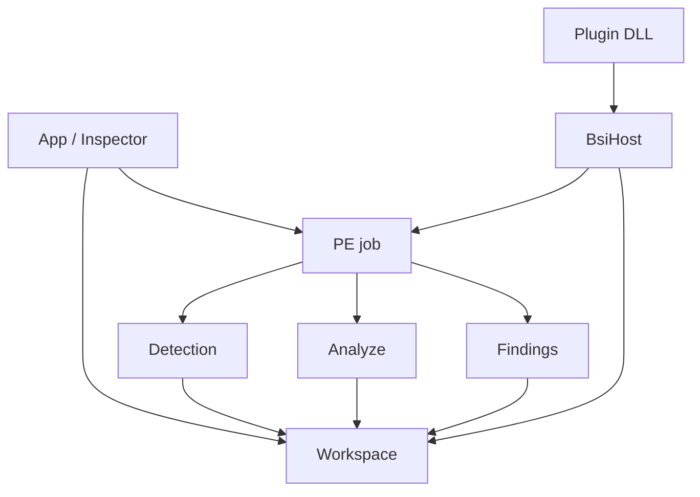

# Mimari

[English](../en/architecture.md) | [Türkçe](architecture.md)

```
src/app        karşılama, inspector kabuğu, ayarlar, sürüm
src/engine     Win32 pencere, D3D11, dosya bırakma
src/pe         eşleme, ayrıştırma, yama, kayıt/yedek
src/detect     olgular, JSON imza, KUARA bağlacı
src/analyze    artifakt sağlayıcıları
src/findings   host bulguları
src/ui         dock, hex, tema, widget
src/plugin     LoadLibrary tarama, BsiHost
src/persist    settings.json, exe yanı yollar
src/i18n       languages/*.json
sdk/plugin     genel ABI başlığı + README
plugins/       altmodüller (Lydis, DecompSnake)
```



**Engine** OS penceresi ve GPU. **App** Welcome / Inspector / Settings. **PE** eşlenen tampon; diğerleri onu okur. **Detection** ve **Findings** ayrı listeler. **Eklentiler** aynı job’u `BsiHost` ile görür (görüntü baytları, hex imleci, toast, ilerleme). `src/` include etmezler.

Arayüz metni değişince hem `languages/en.json` hem `languages/tr.json` güncellenir.

Bu sayfa harita; dosya dosya yorum değil.
